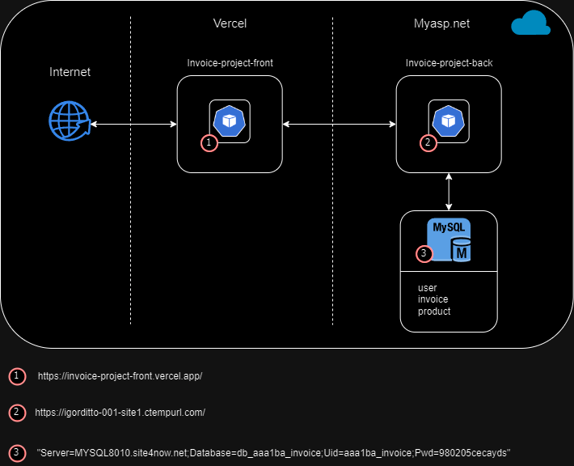
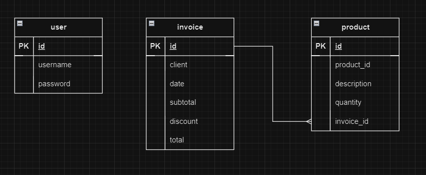

## Invoice Project Backend

- [Descripción de la necesidad](#descripción-de-la-necesidad)
- [Diagrama de componentes de la Interfaz](#diagrama-de-componentes-de-la-interfaz)
- [Mapeo de datos](#mapeo-de-datos)
- [Ejemplos de JSON para Request y Response](#ejemplos-de-json-para-request-y-response)
- [Implementaciones de desarrollo futuras](#implementaciones-de-desarrollo-futuras)

### Descripción de la necesidad


| **Nombre de la interfaz:** | **NOMBRE DE LA INTERACIÓN O API**                            |
| -------------------------- | ------------------------------------------------------------ |
| **Qué**                    | Servicio API para la creación y consulta de facturas asociadas a las compras de diferentes productos            |
| **Porqué**                 | Se requiere llevar un historial de facturas asociadas a los productos que se adquieren |
| **Para que**               | Para que sean creadas o consultadas dentro de los diferentes procesos |

### Diagrama de componentes de la interfaz



| **Nombre Componente**          | **Descripción del componente**                                                                                                                              | **Responsabilidad**   | **Tipo**      | **Herramienta** |
|--------------------------------|-------------------------------------------------------------------------------------------------------------------------------------------------------------|-----------------------|---------------|-----------------
| invoice-project-front           | Servicio fronted de la aplicación     | Llamar microservicios | Microservicio | Angular           |
| invoice-project-front          | Servicio backend de la aplicación     | Consultar base de datos    | Microservicio | .NET            |
| MySql      | Base de datos que almacena la información de la aplicación        | Almacenar   | Base de datos | MySql            |



| **Nombre tabla**          | **Descripción de tabla**  | **Herramienta** |
|--------------------------------|---------------------------|-----------------
| user          | Información autorización de usuarios     |  MySQL           |
| invoice          | Información sobre las facturas     |  MySQL           |
| product          | Información sobre los productos     |  MySQL           |

#### Mapeo de datos

**UserDto**

| **Campo Destino**      | Transformación | Origen                         | Campo Origen    |
|------------------------|----------------|--------------------------------|-----------------|
| **Cuerpo del mensaje** |                |                                |                 |
| Username          | Plano a JSON   | invoice-project-back| | username   |
| Password            | Plano a JSON   | invoice-project-back| | password     |

**InvoiceDto**

| **Campo Destino**      | Transformación | Origen                         | Campo Origen    |
|------------------------|----------------|--------------------------------|-----------------|
| **Cuerpo del mensaje** |                |                                |                 |
| Client          | Plano a JSON   | invoice-project-back| | username   |
| Date            | Plano a JSON   | invoice-project-back| | password     |
| Subtotal            | Plano a JSON   | invoice-project-back| | password     |
| Discount            | Plano a JSON   | invoice-project-back| | password     |


### Ejemplos de json para request y response

**Validar usuario**

- Request -> /api/v1/User/Validate

``` json
{
    "username": "admin",
    "password": "admin"
}
```

- Response

``` json
{
    "response": true,
    "message": "Success",
    "code": 200
}
```

**Obtener lista de facturas**

- Request -> /api/v1/Invoicer/GetInvoiceList

- Response

``` json
{
    "details": [
        {
            "id": 1,
            "client": "client 1",
            "date": "1998-02-05T00:00:00",
            "subtotal": 100000,
            "discount": 10,
            "total": 90000
        },
        {
            "id": 2,
            "client": "client 2",
            "date": "2024-02-05T00:00:00",
            "subtotal": 10000,
            "discount": 10,
            "total": 9000
        }
    ],
    "response": true,
    "message": "Success",
    "code": 200
}
```

**Obtener detalles de factura**

- Request -> /api/v1/Invoicer/GetProductListByInvoiceId/1

- Response

``` json
{
    "details": [
        {
            "id": 1,
            "product_id": 123,
            "quantity": 3,
            "description": "product 1",
            "invoice_id": 1
        },
        {
            "id": 3,
            "product_id": 987,
            "quantity": 7,
            "description": "product 3",
            "invoice_id": 1
        }
    ],
    "response": true,
    "message": "Success",
    "code": 200
}
```

**Crear factura**

- Request -> /api/v1/Invoicer/Create

``` json
{
    "Client": "prueba",
    "Date": "1998-02-05",
    "Subtotal": 100000,
    "Discount": 10
}
```

- Response

``` json
{
    "response": true,
    "message": "Success",
    "code": 200
}
```


### Implementaciones de desarrollo futuras

* Validar fecha de factura para que no permita registrar facturas con días a futuro